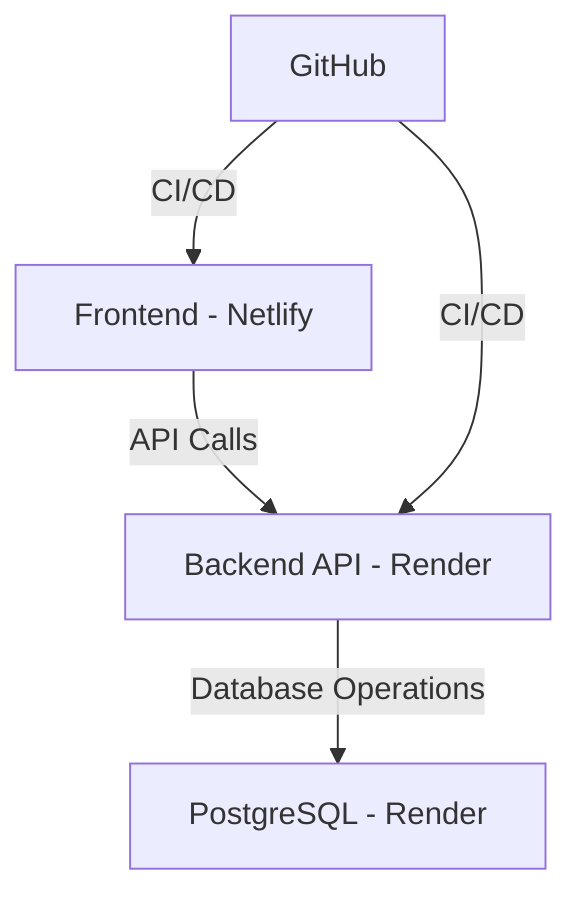

# 🚀 Full-Stack Deployment Ecosystem

A production-ready, cloud-native application demonstrating modern deployment practices with Netlify, Render, and PostgreSQL.

## � Table of Contents
- [Overview](#-overview)
- [Architecture](#-architecture)
- [Features](#-features)
- [Tech Stack](#-tech-stack)
- [Getting Started](#-getting-started)
- [Deployment](#-deployment)
- [Screenshots](#-screenshots)
- [Contributing](#-contributing)
- [License](#-license)

## 🌟 Overview

This project showcases a fully deployed end-to-end full-stack application with a clean, cloud-native architecture. The system integrates multiple cloud services to deliver a robust and scalable solution.

## �️ Architecture



## ✨ Features

### Frontend (Netlify)
- 🚀 Blazing fast static site hosting
- 🔄 Automated deployments on every commit
- 🌍 Global CDN distribution
- 🔧 Built-in CI/CD pipeline

### Backend (Render)
- ⚡ High-performance server runtime
- 🔒 Secure environment management
- 🔄 Auto-scaling capabilities
- �️ DDoS protection

### Database (PostgreSQL on Render)
- 🗄️ Fully managed PostgreSQL
- 🔄 Automated backups
- ⚡ High availability
- 🔒 Secure connections

## 🛠️ Tech Stack

- **Frontend**: [Your frontend framework] (e.g., React, Vue, Angular)
- **Backend**: [Your backend framework] (e.g., Node.js, Python, Java)
- **Database**: PostgreSQL
- **Hosting**:
  - Frontend: Netlify
  - Backend: Render
  - Database: Render PostgreSQL
- **Version Control**: GitHub

## � Getting Started

### Prerequisites
- Node.js (version x.x.x)
- npm (version x.x.x)
- PostgreSQL (version x.x)

### Installation
1. Clone the repository:
   ```bash
   git clone [your-repository-url]
   cd [repository-name]
   ```
2. Install dependencies:
   ```bash
   # Install frontend dependencies
   cd frontend
   npm install
   
   # Install backend dependencies
   cd ../backend
   npm install
   ```
3. Set up environment variables:
   ```env
   # Frontend
   REACT_APP_API_URL=your_api_url
   
   # Backend
   DATABASE_URL=your_database_url
   PORT=3001
   ```

## � Deployment

### Frontend (Netlify)
1. Push your code to GitHub
2. Connect your repository to Netlify
3. Configure build settings:
   - Build command: `npm run build`
   - Publish directory: `build`
4. Deploy!

### Backend & Database (Render)
1. Create a new Web Service on Render
2. Connect your GitHub repository
3. Configure environment variables
4. Deploy!

## 📸 Screenshots

| Feature | Screenshot |
|---------|------------|
| **Frontend** |  |
| **Backend** |  |
| **Database** |  |

## 🤝 Contributing

Contributions are welcome! Please follow these steps:
1. Fork the repository
2. Create a feature branch (`git checkout -b feature/AmazingFeature`)
3. Commit your changes (`git commit -m 'Add some AmazingFeature'`)
4. Push to the branch (`git push origin feature/AmazingFeature`)
5. Open a Pull Request

## 📄 License

This project is licensed under the MIT License - see the [LICENSE](LICENSE) file for details.

---

<div align="center">
  Made by Harish Dubey
</div>
