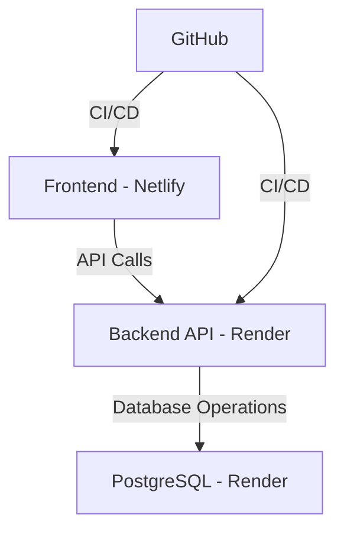

# 🚀 Full-Stack Deployment Ecosystem

A production-ready, cloud-native application demonstrating modern deployment practices with Netlify, Render, and PostgreSQL.

## Bus Management Application

## Table of Contents
- [Overview](#-overview)
- [Architecture](#-architecture)
- [Features](#-features)
- [Tech Stack](#-tech-stack)
- [Deployment](#-deployment)
- [Screenshots](#-screenshots)
- [License](#-license)

## 🌟 Overview

This project showcases a fully deployed end-to-end full-stack application with a clean, cloud-native architecture. The system integrates multiple cloud services to deliver a robust and scalable solution.

## Architecture

## ✨ Features

### Frontend (Netlify)
- Blazing fast static site hosting
- Automated deployments on every commit
- Global CDN distribution
- Built-in CI/CD pipeline

### Backend (Render)
- High-performance server runtime
- Secure environment management
- Auto-scaling capabilities
- DDoS protection

### Database (PostgreSQL)
- Fully managed PostgreSQL
- Automated backups
- High availability
- Secure connections

## 🛠️ Tech Stack

- **Frontend**: [Your frontend framework] (Html, Css, React)
- **Backend**: [Your backend framework] (Java-8, Spring Boot)
- **Database**: PostgreSQL
- **Hosting**:
  - Frontend: Netlify
  - Backend: Render
  - Database: Render PostgreSQL
- **Version Control**: GitHub

## Deployment

### Frontend (Netlify)
1. Push your code to GitHub
2. Connect your repository to Netlify
3. Configure build settings:
   - Build command: `npm run build`
   - Publish directory: `build`
4. Deploy!

### Backend & Database (Render)
1. Create a new Web Service on Render
2. Connect your GitHub repository
3. Configure environment variables
4. Deploy!

## 📸 Screenshots

### Deployment Screenshots

| Component | Screenshot |
|-----------|------------|
| **Frontend Deployment 1** |  |
| **Frontend Deployment 2** |  |
| **Frontend Deployment 3** |  |
| **Backend Deployment** |  |
| **Database Deployment** |  |

## 📄 License

This project is licensed under the IND License - see the [LICENSE](LICENSE) file for details.

---

  Made by Harish Dubey

